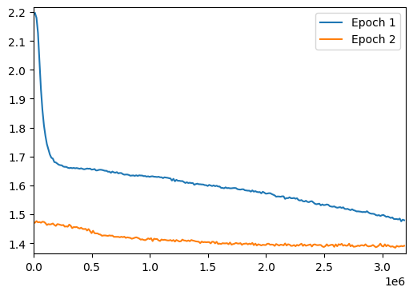
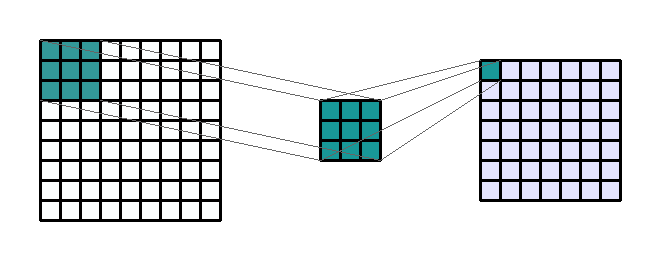
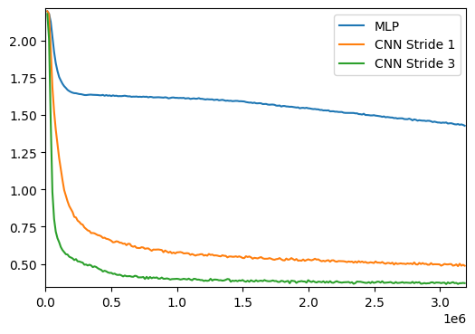
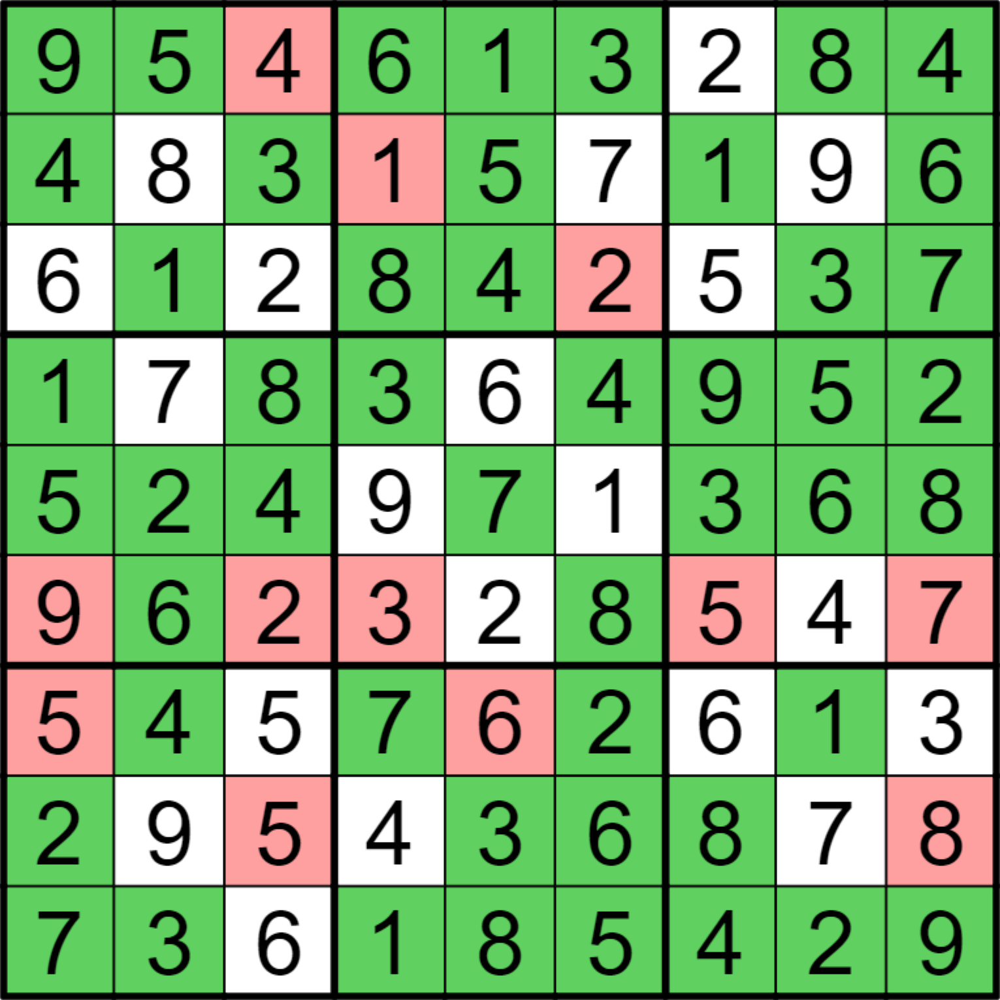
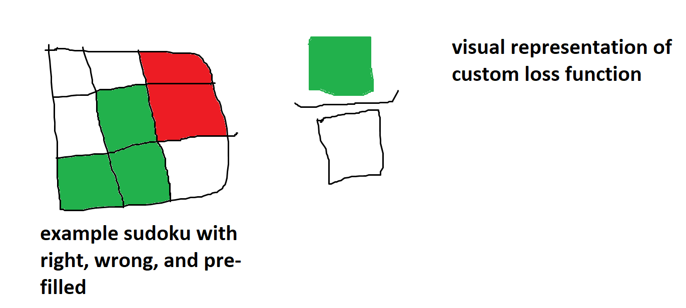

# Sudoku Blog

## Introduction

A group of developers and testers at Scott Logic recently worked through the excellent [Fast AI: Deep Learning for Coders course](https://course.fast.ai/), where we learned a huge amount about understanding and implementing machine learning at a very low level. Since completing the course, we have written blogs on [the basics of layered neural networks](https://blog.scottlogic.com/2024/01/05/neural-net-basics.html), demonstrated [editing images using generative AI](https://blog.scottlogic.com/2023/12/13/diffedit.html), and even [collated a list of the best resources to refer to when learning about AI](https://blog.scottlogic.com/2024/01/09/fast-ai-study-group.html). 

In this post, we aim to take you through our journey to cracking sudoku with artificial intelligence.

We often see neural networks used with sudoku in the realm of computer vision ([Here's an example from Colin Eberhardt at Scott Logic](https://blog.scottlogic.com/2020/01/03/webassembly-sudoku-solver.html)) to recognise a sudoku puzzle from a photo or video but rarely do we see machine learning used as a tool to solve sudoku. We thought using AI in a slightly unconventional way would be an interesting challenge, and allow us to experiment with various techniques to see what worked, what didn't, and what had the greatest impact on helping a model learn. 

We'll take you through the steps we took to tackle this problem using AI, ranging from the way we shaped our data, the models we tried, and the optimisations we used.

## The Data

A machine learning model is nothing without data to train with, and we initially used the excellent [1 Million Sudoku Puzzles](https://www.kaggle.com/datasets/bryanpark/sudoku) dataset found on Kaggle. It provided each puzzle and solution in a csv format, where the first 81 numbers were the inputs, and the next 81 were the solution. The number 0 was used to represent a blank space in the puzzle. One million puzzles seemed like a good amount to be able to train the model without it being able to easily learn to memorise specific puzzles.

### Data Manipulation

The next step was to consider how we should format the puzzle input. We could just pass the numbers directly, and the model would be able to train to a certain level, however passing in the numbers as they are creates a relationship between the different values. Machine learning loss functions work by rewarding the model based on how close their prediction is to the actual value. In sudoku, the numbers do not have an order - if the actual answer is `8`, then if the model guesses `7` it is just as incorrect as if it had guessed `1`. This means that we really want the model to be treating each number as a distinct value, and thankfully there is an established way to do this: __one-hot encoding__.

#### One-Hot Encoding

One-hot encoding works by converting a distinct set of categorical values into a list of numbers which are either `0` or `1`. The position of the `1` within the array determines which value it represents. For example, if we had three categories, representing `red`, `green`, and `blue`, you could represent them in one-hot encoding using the following values:

| Color | Encoded_Red | Encoded_Green | Encoded_Blue |
|-------|-------------|---------------|--------------|
| Red   | 1           | 0             | 0            |
| Green | 0           | 1             | 0            |
| Blue  | 0           | 0             | 1            |

We can do the same thing with numbers in sudoku. In the input data we have the numbers 0-9 (where 0 is blank), and in the output we want our model to be able to output numbers between 1-9. We can both represent 0 in the input and limit the output by having a one-hot encoding where `0` is represented by all zeros in the one-hot encoding:

| Number | One-Hot Encoding |
|--------|------------------|
| 0      | `[0, 0, 0, 0, 0, 0, 0, 0, 0]` |
| 1      | `[1, 0, 0, 0, 0, 0, 0, 0, 0]` |
| 2      | `[0, 1, 0, 0, 0, 0, 0, 0, 0]` |
| 3      | `[0, 0, 1, 0, 0, 0, 0, 0, 0]` |
| 4      | `[0, 0, 0, 1, 0, 0, 0, 0, 0]` |
| 5      | `[0, 0, 0, 0, 1, 0, 0, 0, 0]` |
| 6      | `[0, 0, 0, 0, 0, 1, 0, 0, 0]` |
| 7      | `[0, 0, 0, 0, 0, 0, 1, 0, 0]` |
| 8      | `[0, 0, 0, 0, 0, 0, 0, 1, 0]` |
| 9      | `[0, 0, 0, 0, 0, 0, 0, 0, 1]` |

When our model makes predictions, we will want it to output a one-hot encoding for each number in the puzzle. We can use this to understand how confident it is that each number would fit in that space.

For example, the below list may be the model's predictions for a particular cell within the puzzle, averaged to total 1 overall:

`[0.01, 0.02, 0.03, 0.01, 0.01, 0.21, 0.03, 0.01, 0.67]`

We can see that most of the predictions are quite small, but the final number in the list is `0.67`, which represents a 67% certainty of it being the number `9`. If the correct answer for that cell was the number `9`, then the ideal answer would have been `[0, 0, 0, 0, 0, 0, 0, 0, 1]`. We can use a loss function to calculate how different the model's prediction was to the correct answer, and then feed that back to the model so it can update its weights to improve future predictions.

#### Changing Scale

So far we have mainly been looking at how one-hot encoding works for a single number, but we need to do this for the whole 9x9 grid, and for all one million puzzles. Thankfully pytorch makes this fairly easy to do the conversion as it provides a function called `one_hot`. Given a tensor, this function automatically converts it into a one-hot encoded version of the tensor. This, paired with a transform function on the dataset, allows us to convert all of our puzzles.

#### Dataset

The dataset uses a class provided by pytorch, which we define to have an optional `transform` function. When this function is passed in to the init, it is then applied to the data when accessing a certain item.

```python
class CustomSudokuDataset(Dataset):
    def __init__(self, quizzes, solutions, transform=None, target_transform=None):
        self.quizzes = torch.from_numpy(quizzes).to(torch.int64)
        self.solutions = torch.from_numpy(solutions).to(torch.int64)
        self.transform = transform
        self.target_transform = target_transform

    def __len__(self):
        return len(self.quizzes)

    def __getitem__(self, idx):
        quiz = self.quizzes[idx]
        solution = self.solutions[idx]
        if self.transform:
            quiz = self.transform(quiz)
        if self.target_transform:
            solution = self.target_transform(solution)
        return quiz.type(torch.float).to("cuda"), solution.type(torch.long).to("cuda")
```

#### Transform function

The transform function is our one-hot encoding of the data, which we define as follows:

```python
def one_hot_options(input_tensor):
    return F.one_hot(input_tensor, 10)[:,1:]
```

We use `[:,1:]` to cut off the initial column of data as we don't want to also encode 0 explicitly, rather preferring the absence of any `1`s within the list to represent a `0`.

#### Putting it all together

We then create the dataset, passing in our one-hot transform function to convert the data into the format we want.

```python
dataset = CustomSudokuDataset(quizzes, solutions, one_hot_options)

training_data, validation_data = random_split(dataset, [0.8, 0.2], generator=generator)
```

We can then use pytorch's `random_split` function to split the dataset into our training and validation sets, and we'll later use a `DataLoader` to get the batches of data for our model within the training and validation loops.

### Dataset difficulty

TODO: should we talk about how many puzzles easy/hard etc. (count total numbers given in input?)

## Models

We explored two different model architectures in our quest to solve sudoku with neural networks.

### Initial Model: Multilayer Perceptron (MLP)

The MLP is the most recognisable neural network. The MLP consists of at least three layers: input, hidden, and output. All neurons are connected to all the rest in the layer ahead of them. The weights of the neurons' connections are altered throughout the learning process via backpropagation in order to allow the network to learn based on input data.

Our first model consisted of an MLP with three linear layers, including one hidden layer. These layers are interspersed with non-linear activation functions in the form of rectified linear units (ReLUs). You can see this model defined in pytorch as follows:

```python
class MLP(nn.Module):
    def __init__(self):
        super().__init__()
        self.flatten = nn.Flatten()
        self.unflatten = nn.Unflatten(1, (81, 9))
        
        self.linear_relu_stack = nn.Sequential(
            nn.Linear(729, 100),
            nn.ReLU(),
            nn.Linear(100, 100),
            nn.ReLU(),
            nn.Linear(100, 729),
        )

    def forward(self, x):
        x = self.flatten(x)
        logits = self.linear_relu_stack(x)
        return self.unflatten(logits)
```

We also created a function which can count the number of parameters in a particular model. This is a good baseline to understand the model's capability for learning. Too few parameters and it may not have enough learning capacity to learn the complexities of what we're training it on. Too many parameters and the model can become difficult to train and is more susceptible to memorisation - learning specific solutions rather than generalising appropriately.

The `MLP` model we defined above has 156,729 learnable parameters, which we will use as a baseline to compare to future models.

<div align="center">
    
</div>

### Training

TODO: discuss how we trained our models?


### Testing our models

While training the model we capture the loss which helps us train the model, but this loss number doesn't really mean much to us humans. We decided that there were two metrics that we'd be interested in also looking at, to compare model performance:

1. On average, how many numbers the model accurately guesses vs. the solution
2. What percentage of puzzles the model can solve 100% correctly (no incorrect numbers whatsoever)

Our plan was to train our models against our standard loss calculations, and then once trained, verify the performance using these two metrics. We would run the trained model against the validation dataset to ensure it had never seen any of the puzzles before.

We also read about an interesting technique to improve model performance in sudoku from a GitHub repository called [Can Convolutional Neural Networks Crack Sudoku Puzzles?](https://github.com/Kyubyong/sudoku), where they only take the single number the model is most sure about, update the input with this number and then feed this updated model back into the model, until the puzzle is completely filled out. We decided to also measure the model performance when used this way as well, which we will refer to as "iterative guesses" in the performance tables throughout this blog.

So how did our `MLP` model do? Well, after being trained on over 6 million sudoku puzzles, we put it to the test and you can see the results in the table below:

| Model | % puzzles correct (single guess) | % puzzles correct (iterative guesses) | % numbers correct (iterative guesses) |
| ----- | -------------------------------- | ------------------------------------- | ------------------------------------- |
| MLP   | 0.0%                             | 1.3%                                  | 68.7%                                 |

Not a great performance. While the model does get almost 70% of the individual numbers correct, it only managed to correctly solve 1.3% of the puzzles, and that's using the iterative guessing technique to help it out!

As you can see from the graph in the training section above, the model training had started to plateau. This means it was unlikely to improve much further if we trained it for longer. Because of this, we decide to experiment with other model architectures to see if they would perform better.

### Convolutional Neural Network (CNN)

A CNN is a neural network often used for image recognition. It is made up of convolution layers, which typically generate values by using a sliding window to look over the input data. This sliding window is called a kernel, and you can define the shape of this kernel and how much it jumps each time it moves across the data (called the stride).

The gif below demonstrates a 3x3 kernel with a stride of 1 on a 9x9 input:



We were particularly interested in this technique, as it feels like you may be able to encode some of the rules of sudoku into that kernel size and stride, so our idea was to have an initial kernel size of 3 and a stride of 3, to emulate the 3x3 boxes you have to complete within a sudoku to solve the puzzle. This convolution layer would behave like this:

<div align="center">
    
</div>

We hypothesised that this would give the model a head start in training, by helping it to understand the rules of sudoku since we focus the model's attention on these 3x3 grids.

Our pytorch definition of this model looks like this:

```python
class CNNBase(nn.Module):
    def __init__(self):
        super().__init__()
        
        self.linear_relu_stack = nn.Sequential(
            nn.Conv2d(9, 81, kernel_size=3, stride=3), # 3x3
            nn.ReLU(),
            nn.Conv2d(81, 729, kernel_size=3, stride=3), # 1x1
        )

    def forward(self, x):
        mod_x = x.permute([0,2,1])
        mod_x = mod_x.unflatten(2,(9,9))
        logits = self.linear_relu_stack(mod_x)
        logits = logits.squeeze().unflatten(1, (81,9))
        return logits
```

We added an additional `Conv2d` layer at the end to make the output have a shape of 1x1, with 729 nodes. This was done because the expected output of the model is 729 numbers (9x9 grid with 1-hot encoding for numbers 1-9 = 9x9x9 = 729).

Again we checked the total number of learnable parameters in the model, and this time it was 538,812, so quite a lot more than our initial MLP model.

#### Training the CNN

When training the model, we wanted to compare it directly to the performance of our MLP model, both in terms of trainability and our testing metrics outlined above. We also wanted to compare our stride 3 CNN which we believed would help it learn the rules, with a stride 1 CNN which might be more of a generic learner. You can see the results of the training over one epoch in the graph below:



It was immediately clear that both CNNs were much faster learners than our MLP model, and very quickly surpassed the lowest loss that the MLP model was capable of achieving. The stride 3 CNN training better than the stride 1 CNN also seemed to validate our hypothesis that encoding the rules into the model helped it to learn more efficiently! We decided to stick with the stride 3 CNN rather than progress with the stride 1 CNN any further.

#### Testing the CNN

Finally for this model, we also ran it against our test code, seeing how many numbers and puzzles it got correct, these results are shown in the table below:

| Model           | % puzzles correct (single guess) | % puzzles correct (iterative guesses) | % numbers correct (iterative guesses) |
| --------------- | -------------------------------- | ------------------------------------- | ------------------------------------- |
| MLP             | 0.0%                             | 1.3%                                  | 68.7%                                 |
| CNN stride 3    | 24.7%                            | 35.5%                                 | 83.3%                                 |

The stride 3 CNN model was clearly a huge improvement over the MLP model, managing to get over 35% of all puzzles correct when using the iterative guessing strategy, and a very impressive 83% of all numbers correctly guessed.

This model clearly was performing much better than the previous one, but something we wanted to be sure of was whether it was down to the model architecture we'd chosen, or was it down to the additional learnable parameters this model had (~540k vs MLP's ~155k), which just gave it a much higher capability for learning?

#### Further improvements

<div align="center">
    
    
</div>

### Model Comparisons


## Loss Function

<div align="center">
    
    
</div>

## Learning Rates

The learning rate of a model can have a huge impact on how well it trains. If you set the learning rate too low it may take far too long to train the model effectively, too high and it may never train at all. This is why it is very important to set a good learning rate for your model. Here's an example of one of our models being trained at different learning rates:


You can see that a learning rate that is high trains quickly and then struggles to become very accurate, whereas a learning rate that is too low will train very slowly, and may also get stuck in a local minimum, rather than learning to generalise correctly. At the end of each of the training epochs above, we also ran each model against our validation data to get the accuracy and loss values:

| Learning Rate | Accuracy | Avg Loss |
|---------------|----------|----------|
| 0.01          | 81.5%    | 0.484478 |
| 0.001         | 84.8%    | 0.378975 |
| 0.0001        | 81.9%    | 0.419171 |
| 1e-05         | 80.4%    | 0.640535 |
| 1e-06         | 64.9%    | 1.186333 |

You can see that even a small change in loss (e.g. ~0.42 to ~0.38) can add multiple percentage points to the accuracy of the model, which is why finding a good learning rate for your model is so important.

Each model may have wildly different learning rate values at which they train well. This depends on the model's architecture, optimiser, and other features, and so finding the correct learning rate can be difficult. Because of this, we wrote a helper function to find the optimal learning rate for us. The basic idea is that we run a training loop, and after a few batches increase the learning rate by 1.3x. As we complete batches, we keep track of the model's loss, and plot this on a log graph. This allows us to see what an effective learning rate would be for a particular model. This idea is taken from the [Fast AI: Deep Learning for Coders course](https://course.fast.ai/) we mentioned earlier, with some modifications to stabilise the loss plot with the dataset we use.

An example output from our learning rate finder is as follows:


As you can see, in this example, the model's loss is lowest between 10<sup>-4</sup> and between 10<sup>-3</sup>. When training the model, typically the model needs a slightly lower learning rate as it trains, to help it become more accurate. To adjust for this we want to pick a learning rate which is still on the downward slope of the loss plot, so in this case a learning rate of 10<sup>-4</sup> would be a good initial value.

### Learning Rate Decay
To improve training further, it's possible to reduce the learning rate over time. This works by first setting the learning rate relatively high, which allows the model to generalise by using a large learning rate, and then once it is no longer training effectively at that learning rate, we can reduce the learning rate, allowing it to learn complex patterns more effectively. For more information see this [research paper discussing how learning rate decay helps neural networks](https://arxiv.org/pdf/1908.01878.pdf).

Pytorch again provides classes which can help with this, and we decided to use the `ReduceLROnPlateau` class, which allows the learning rate to be automatically reduced by a certain factor if no learning has been detected for a period of time. In our last section, we saw that a learning rate of 0.001 worked well for our model, so we wanted to compare this static learning rate with a higher learning rate along with this learning rate scheduler. You can see these results in the graph below:


What is immediately obvious is that using a learning rate scheduler which starts at a high learning rate is even better than the best static learning rate we had found. Once the learning rate is dropped, the model begins to train very quickly again, improving performance and leading to better loss values.

#### Rate of Decay

The `ReduceLROnPlateau` class allows you to set a factor which the learning rate is multiplied by to reduce the learning rate. The [pytorch documentation](https://pytorch.org/docs/stable/generated/torch.optim.lr_scheduler.ReduceLROnPlateau.html) for this class suggests this value should be a reduction between 2-10x each step. We ran three versions of the model with various scheduler factors, and found that a factor of 0.2 (or 2x reduction) each step was the most effective for our model:

| Learning Rate           | Test Accuracy | Average Loss |
|-------------------------|---------------|--------------|
| 0.01 + scheduler 0.5    |     86.1%     |   0.348949   |
| 0.01 + scheduler 0.2    |     85.9%     |   0.426110   |
| 0.01 + scheduler 0.1    |     85.6%     |   0.624774   |

## Batch Normalisation

What is normalisation - what is batch version? Reduces effect of internal covariate shift in model parameters which is changes in their distributions. Makes training quicker and less all over the place (technical term).


## Optimiser

The optimiser is involved in updating the parameters of the model during the training process. It aims to minimise the loss function...

### SGD vs Adam

Adam uses momentum (what is?), cares less about hyper parameters, changes learning rate. SGD is the most basic. Adam converges faster, SGD may generalise better

## More Data

Does 4 million data set bring any advantages? Are our architectures large enough to make use of more data?

## Results

How accurate? Compare to different implementations both AI and programmatic ones potentially.

## Conclusion

Is using neural networks to solve sudoku a good idea? What did we learn from this task?
