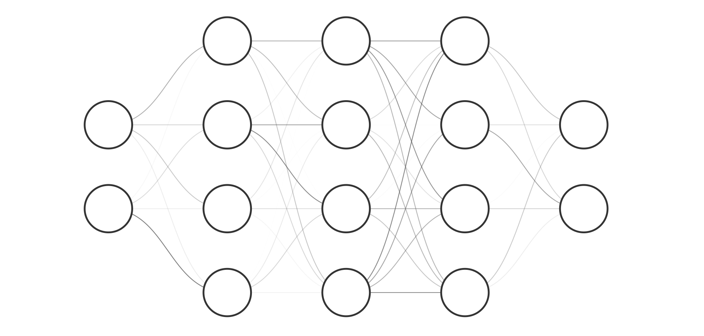
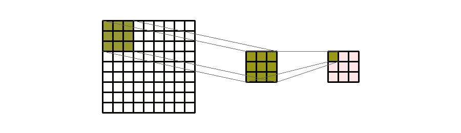
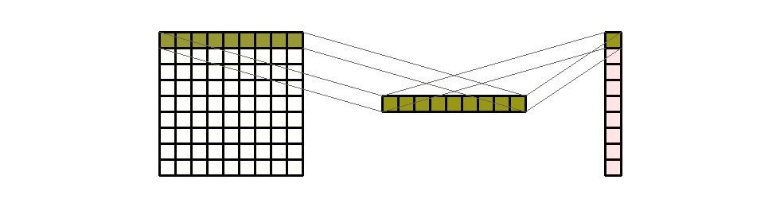
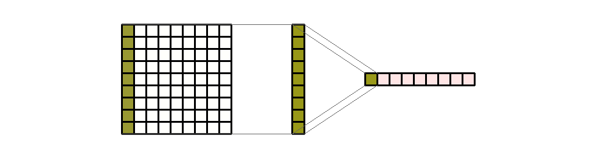
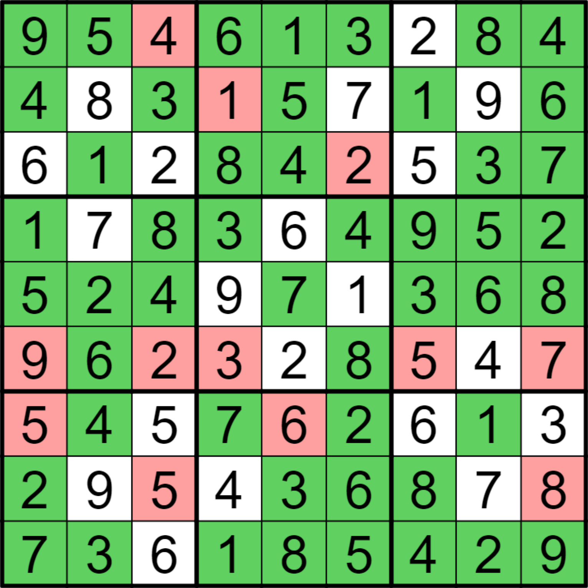
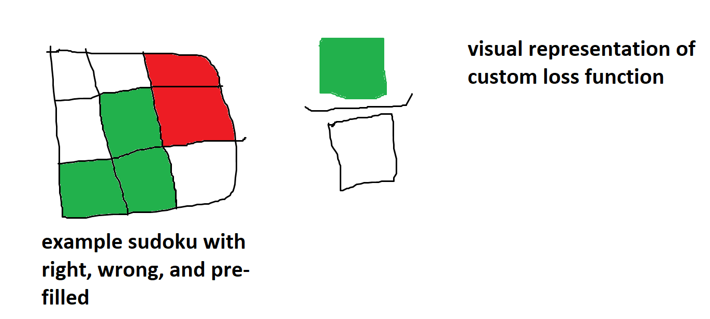

# Sudoku Blog

## Introduction

We often see neural networks used with sudoku in the realm of computer vision (link to Colin blog) to recognise a sudoku puzzle from a photo or video but rarely do we see machine learning used as a tool to solve sudoku. In this post, we aim to take you through our journey to cracking sudoku with artificial intelligence.

## The Data

A machine learning model is nothing without data to train with, and we initially used the excellent [1 Million Sudoku Puzzles](https://www.kaggle.com/datasets/bryanpark/sudoku) dataset found on Kaggle. It provided each puzzle and solution in a csv format, where the first 81 numbers were the inputs, and the next 81 were the solution. The number 0 was used to represent a blank space in the puzzle. One million puzzles seemed like a good amount to be able to train the model without it being able to easily learn to memorise specific puzzles.

### Data Manipulation

The next step was to consider how we should format the puzzle input. We could just pass the numbers directly, and the model would be able to train to a certain level, however passing in the numbers as they are creates a relationship between the different values. Machine learning loss functions work by rewarding the model based on how close their prediction is to the actual value. In sudoku, the numbers do not have an order - if the actual answer is `8`, then if the model guesses `7` it is just as incorrect as if it had guessed `1`. This means that we really want the model to be treating each number as a distinct value, and thankfully there is an established way to do this: __one-hot encoding__.

#### One-Hot Encoding

One-hot encoding works by converting a distinct set of categorical values into a list of numbers which are either `0` or `1`. The position of the `1` within the array determines which value it represents. For example, if we had three categories, representing `red`, `green`, and `blue`, you could represent them in one-hot encoding using the following values:

| Color | Encoded_Red | Encoded_Green | Encoded_Blue |
|-------|-------------|---------------|--------------|
| Red   | 1           | 0             | 0            |
| Green | 0           | 1             | 0            |
| Blue  | 0           | 0             | 1            |

We can do the same thing with numbers in sudoku. In the input data we have the numbers 0-9 (where 0 is blank), and in the output we want our model to be able to output numbers between 1-9. We can both represent 0 in the input and limit the output by having a one-hot encoding where `0` is represented by all zeros in the one-hot encoding:

| Number | One-Hot Encoding |
|--------|------------------|
| 0      | `[0, 0, 0, 0, 0, 0, 0, 0, 0]` |
| 1      | `[1, 0, 0, 0, 0, 0, 0, 0, 0]` |
| 2      | `[0, 1, 0, 0, 0, 0, 0, 0, 0]` |
| 3      | `[0, 0, 1, 0, 0, 0, 0, 0, 0]` |
| 4      | `[0, 0, 0, 1, 0, 0, 0, 0, 0]` |
| 5      | `[0, 0, 0, 0, 1, 0, 0, 0, 0]` |
| 6      | `[0, 0, 0, 0, 0, 1, 0, 0, 0]` |
| 7      | `[0, 0, 0, 0, 0, 0, 1, 0, 0]` |
| 8      | `[0, 0, 0, 0, 0, 0, 0, 1, 0]` |
| 9      | `[0, 0, 0, 0, 0, 0, 0, 0, 1]` |

When our model makes predictions, we will want it to output a one-hot encoding for each number in the puzzle. We can use this to understand how confident it is that each number would fit in that space.

For example, the below list may be the model's predictions for a particular cell within the puzzle, averaged to total 1 overall:

`[0.01, 0.02, 0.03, 0.01, 0.01, 0.21, 0.03, 0.01, 0.67]`

We can see that most of the predictions are quite small, but the final number in the list is `0.67`, which represents a 67% certainty of it being the number `9`. If the correct answer for that cell was the number `9`, then the ideal answer would have been `[0, 0, 0, 0, 0, 0, 0, 0, 1]`. We can use a loss function to calculate how different the model's prediction was to the correct answer, and then feed that back to the model so it can update its weights to improve future predictions.

#### Changing Scale

So far we have mainly been looking at how one-hot encoding works for a single number, but we need to do this for the whole 9x9 grid, and for all one million puzzles. Thankfully pytorch makes this fairly easy to do the conversion as it provides a function called `one_hot`. Given a tensor, this function automatically converts it into a one-hot encoded version of the tensor. This, paired with a transform function on the dataset, allows us to convert all of our puzzles.

#### Dataset

The dataset uses a class provided by pytorch, which we define to have an optional `transform` function. When this function is passed in to the init, it is then applied to the data when accessing a certain item.

```python
class CustomSudokuDataset(Dataset):
    def __init__(self, quizzes, solutions, transform=None, target_transform=None):
        self.quizzes = torch.from_numpy(quizzes).to(torch.int64)
        self.solutions = torch.from_numpy(solutions).to(torch.int64)
        self.transform = transform
        self.target_transform = target_transform

    def __len__(self):
        return len(self.quizzes)

    def __getitem__(self, idx):
        quiz = self.quizzes[idx]
        solution = self.solutions[idx]
        if self.transform:
            quiz = self.transform(quiz)
        if self.target_transform:
            solution = self.target_transform(solution)
        return quiz.type(torch.float).to("cuda"), solution.type(torch.long).to("cuda")
```

#### Transform function

The transform function is our one-hot encoding of the data, which we define as follows:

```python
def one_hot_options(input_tensor):
    return F.one_hot(input_tensor, 10)[:,1:]
```

We use `[:,1:]` to cut off the initial column of data as we don't want to also encode 0 explicitly, rather preferring the absence of any `1`s within the list to represent a `0`.

#### Putting it all together

We then create the dataset, passing in our one-hot transform function to convert the data into the format we want.

```python
dataset = CustomSudokuDataset(quizzes, solutions, one_hot_options)

training_data, validation_data = random_split(dataset, [0.8, 0.2], generator=generator)
```

We can then use pytorch's `random_split` function to split the dataset into our training and validation sets, and we'll later use a `DataLoader` to get the batches of data for our model within the training and validation loops.

## Model Architectures

We explored two different model architectures in our quest to solve sudoku with neural networks.

### Multilayer Perceptron (MLP)

The most recognisable neural network. The MLP consists of at least three layers: input, hidden, and output. All neurons are connected to all the rest in the layer ahead of them. The weights of the neurons' connections are altered throughout the learning process via backpropagation in order to allow the network to learn based on input data.

Our first model consisted of an MLP with three hidden linear layers, interspersed with non-linear activation functions in the form of rectified linear units (ReLUs). This model performed...

<div align="center">
    
</div>

### Convolutional Neural Network (CNN)

A CNN uses convolutions over tensors to facilitate machine learning. The kernel moves over...

Explanation of kernels and incorporating rules.

<div align="center">
    
    
    
</div>

## Loss Function

<div align="center">
    
    
</div>

## Batch Normalisation

What is normalisation - what is batch version? Reduces effect of internal covariate shift in model parameters which is changes in their distributions. Makes training quicker and less all over the place (technical term).

## Optimiser

The optimiser is involved in updating the parameters of the model during the training process. It aims to minimise the loss function...

### SGD vs Adam

Adam uses momentum (what is?), cares less about hyper parameters, changes learning rate. SGD is the most basic. Adam converges faster, SGD may generalise better

## More Data

Does 4 million data set bring any advantages? Are our architectures large enough to make use of more data?

## Results

How accurate? Compare to different implementations both AI and programmatic ones potentially.

## Conclusion

Is using neural networks to solve sudoku a good idea? What did we learn from this task?
