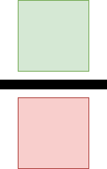

# Sudoku Blog

## Introduction

A group of developers and testers at Scott Logic recently worked through the excellent [Fast AI: Deep Learning for Coders course](https://course.fast.ai/), where we learned a huge amount about understanding and implementing machine learning at a very low level. Since completing the course, we have written blogs on [the basics of layered neural networks](https://blog.scottlogic.com/2024/01/05/neural-net-basics.html), demonstrated [editing images using generative AI](https://blog.scottlogic.com/2023/12/13/diffedit.html), and even [collated a list of the best resources to refer to when learning about AI](https://blog.scottlogic.com/2024/01/09/fast-ai-study-group.html).

In this post, we aim to take you through our journey to cracking sudoku with artificial intelligence.

We often see neural networks used with sudoku in the realm of computer vision ([Here's an example from Colin Eberhardt at Scott Logic](https://blog.scottlogic.com/2020/01/03/webassembly-sudoku-solver.html)) to recognise a sudoku puzzle from a photo or video but rarely do we see machine learning used as a tool to solve sudoku. We thought using AI in a slightly unconventional way would be an interesting challenge, and allow us to experiment with various techniques to see what worked, what didn't, and what had the greatest impact on helping a model learn.

We'll take you through the steps we took to tackle this problem using AI, ranging from the way we shaped our data, the models we tried, and the optimisations we used.

## The Data

A machine learning model is nothing without data to train with, and we initially used the excellent [1 Million Sudoku Puzzles](https://www.kaggle.com/datasets/bryanpark/sudoku) dataset found on Kaggle. It provided each puzzle and solution in a csv format, where the first 81 numbers were the inputs, and the next 81 were the solution. The number 0 was used to represent a blank space in the puzzle. One million puzzles seemed like a good amount to be able to train the model without it being able to easily learn to memorise specific puzzles.

### Data Manipulation

The next step was to consider how we should format the puzzle input. We could just pass the numbers directly, and the model would be able to train to a certain level, however passing in the numbers as they are creates a relationship between the different values. Machine learning loss functions work by rewarding the model based on how close their prediction is to the actual value. In sudoku, the numbers do not have an order - if the actual answer is `8`, then if the model guesses `7` it is just as incorrect as if it had guessed `1`. This means that we really want the model to be treating each number as a distinct value, and thankfully there is an established way to do this: **one-hot encoding**.

#### One-Hot Encoding

One-hot encoding works by converting a distinct set of categorical values into a list of numbers which are either `0` or `1`. The position of the `1` within the array determines which value it represents. For example, if we had three categories, representing `red`, `green`, and `blue`, you could represent them in one-hot encoding using the following values:

| Color | Encoded_Red | Encoded_Green | Encoded_Blue |
| ----- | ----------- | ------------- | ------------ |
| Red   | 1           | 0             | 0            |
| Green | 0           | 1             | 0            |
| Blue  | 0           | 0             | 1            |

We can do the same thing with numbers in sudoku. In the input data we have the numbers 0-9 (where 0 is blank), and in the output we want our model to be able to output numbers between 1-9. We can both represent 0 in the input and limit the output by having a one-hot encoding where `0` is represented by all zeros in the one-hot encoding:

| Number | One-Hot Encoding              |
| ------ | ----------------------------- |
| 0      | `[0, 0, 0, 0, 0, 0, 0, 0, 0]` |
| 1      | `[1, 0, 0, 0, 0, 0, 0, 0, 0]` |
| 2      | `[0, 1, 0, 0, 0, 0, 0, 0, 0]` |
| 3      | `[0, 0, 1, 0, 0, 0, 0, 0, 0]` |
| 4      | `[0, 0, 0, 1, 0, 0, 0, 0, 0]` |
| 5      | `[0, 0, 0, 0, 1, 0, 0, 0, 0]` |
| 6      | `[0, 0, 0, 0, 0, 1, 0, 0, 0]` |
| 7      | `[0, 0, 0, 0, 0, 0, 1, 0, 0]` |
| 8      | `[0, 0, 0, 0, 0, 0, 0, 1, 0]` |
| 9      | `[0, 0, 0, 0, 0, 0, 0, 0, 1]` |

When our model makes predictions, we will want it to output a one-hot encoding for each number in the puzzle. We can use this to understand how confident it is that each number would fit in that space.

For example, the below list may be the model's predictions for a particular cell within the puzzle, averaged to total 1 overall:

`[0.01, 0.02, 0.03, 0.01, 0.01, 0.21, 0.03, 0.01, 0.67]`

We can see that most of the predictions are quite small, but the final number in the list is `0.67`, which represents a 67% certainty of it being the number `9`. If the correct answer for that cell was the number `9`, then the ideal answer would have been `[0, 0, 0, 0, 0, 0, 0, 0, 1]`. We can use a loss function to calculate how different the model's prediction was to the correct answer, and then feed that back to the model so it can update its weights to improve future predictions.

#### Changing Scale

So far we have mainly been looking at how one-hot encoding works for a single number, but we need to do this for the whole 9x9 grid, and for all one million puzzles. Thankfully Pytorch makes this fairly easy to do the conversion as it provides a function called `one_hot`. Given a tensor, this function automatically converts it into a one-hot encoded version of the tensor. This, paired with a transform function on the dataset, allows us to convert all of our puzzles.

#### Dataset

The dataset uses a class provided by Pytorch, which we define to have an optional `transform` function. When this function is passed in to the init, it is then applied to the data when accessing a certain item.

```python
class CustomSudokuDataset(Dataset):
    def __init__(self, quizzes, solutions, transform=None, target_transform=None):
        self.quizzes = torch.from_numpy(quizzes).to(torch.int64)
        self.solutions = torch.from_numpy(solutions).to(torch.int64)
        self.transform = transform
        self.target_transform = target_transform

    def __len__(self):
        return len(self.quizzes)

    def __getitem__(self, idx):
        quiz = self.quizzes[idx]
        solution = self.solutions[idx]
        if self.transform:
            quiz = self.transform(quiz)
        if self.target_transform:
            solution = self.target_transform(solution)
        return quiz.type(torch.float).to("cuda"), solution.type(torch.long).to("cuda")
```

#### Transform function

The transform function is our one-hot encoding of the data, which we define as follows:

```python
def one_hot_options(input_tensor):
    return F.one_hot(input_tensor, 10)[:,1:]
```

We use `[:,1:]` to cut off the initial column of data as we don't want to also encode 0 explicitly, rather preferring the absence of any `1`s within the list to represent a `0`.

#### Putting it all together

We then create the dataset, passing in our one-hot transform function to convert the data into the format we want.

```python
dataset = CustomSudokuDataset(quizzes, solutions, one_hot_options)

training_data, validation_data = random_split(dataset, [0.8, 0.2], generator=generator)
```

We can then use Pytorch's `random_split` function to split the dataset into our training and validation sets, and we'll later use a `DataLoader` to get the batches of data for our model within the training and validation loops.

## Model Architectures

We explored two different model architectures in our quest to solve sudoku with neural networks.

### Multilayer Perceptron (MLP)

The most recognisable neural network. The MLP consists of at least three layers: input, hidden, and output. All neurons are connected to all the rest in the layer ahead of them. The weights of the neurons' connections are altered throughout the learning process via backpropagation in order to allow the network to learn based on input data.

Our first model consisted of an MLP with three hidden linear layers, interspersed with non-linear activation functions in the form of rectified linear units (ReLUs). This model performed...

<div align="center">
    
</div>

### Convolutional Neural Network (CNN)

A CNN uses convolutions over tensors to facilitate machine learning. The kernel moves over...

Explanation of kernels and incorporating rules.

<div align="center">
    
    
    
</div>

## Loss Function

<div align="center">
    
</div>

Given that the loss function is what drives the learning process of a neural network, we put a lot of time and thought into which one to use for this particular problem.

The base loss function that we decided on in the end was CrossEntropy. This loss function is often used in multi-classification problems and sudoku can be thought of along these lines. For each blank cell, our model must look at the rest of the cells in the puzzle and determine what to fill it with. There are nine options for a sudoku puzzle so in essence the model is attempting to classify each cell and we take its best guess (the value with the highest probability) and use that to fill in the blank.

### Preprocessing

We settled on a loss function but we could not call it a day there. In order for the model to be able to produce good results, we decided to look at a few different methods of preprocessing the output data before passing it to the loss function.

Our first method (`compare_all`) is our most straightforward. We look at each number in the predicted sudoku grid and determine whether or not it is correct (comparing to the known values). We do not care if any value is already in the grid - we treat every value the same and each is either right or wrong.

(The following diagrams aim to visualise how we differentiate sudoku cell values during preprocessing. The key is: Green - Correct, Red - Wrong, Yellow - Prefilled Correct, Purple - Prefilled Wrong. We compare the cells above the line to the cells below the line to determine how well the sudoku performs.)

<div align="center">
    
</div>

Our second method (`replace_known`) takes into account known values in the initial sudoku grid. We disregard the model's predictions for prefilled cells by removing the known values from the predictions set altogether. In the end, we compare only the model's predictions of the blank squares.

<div align="center">
    
</div>

Our last method (`remove_wrong`) is a hybrid of the two prior ones. It replaces incorrect answers with 0 (representing a blank square), perhaps to simulate undoing a mistake.

After analysis of the performance of the different preprocessing methods with various different models, we came to the surprising conclusion that our first and most basic produced the best results.

<div align="center">
    
</div>

## Learning Rates

The learning rate of a model can have a huge impact on how well it trains. If you set the learning rate too low it may take far too long to train the model effectively, too high and it may never train at all. This is why it is very important to set a good learning rate for your model. Here's an example of one of our models being trained at different learning rates:


You can see that a learning rate that is high trains quickly and then struggles to become very accurate, whereas a learning rate that is too low will train very slowly, and may also get stuck in a local minimum, rather than learning to generalise correctly. At the end of each of the training epochs above, we also ran each model against our validation data to get the accuracy and loss values:

| Learning Rate | Accuracy | Avg Loss |
| ------------- | -------- | -------- |
| 0.01          | 81.5%    | 0.484478 |
| 0.001         | 84.8%    | 0.378975 |
| 0.0001        | 81.9%    | 0.419171 |
| 1e-05         | 80.4%    | 0.640535 |
| 1e-06         | 64.9%    | 1.186333 |

You can see that even a small change in loss (e.g. ~0.42 to ~0.38) can add multiple percentage points to the accuracy of the model, which is why finding a good learning rate for your model is so important.

Each model may have wildly different learning rate values at which they train well. This depends on the model's architecture, optimiser, and other features, and so finding the correct learning rate can be difficult. Because of this, we wrote a helper function to find the optimal learning rate for us. The basic idea is that we run a training loop, and after a few batches increase the learning rate by 1.3x. As we complete batches, we keep track of the model's loss, and plot this on a log graph. This allows us to see what an effective learning rate would be for a particular model. This idea is taken from the [Fast AI: Deep Learning for Coders course](https://course.fast.ai/) we mentioned earlier, with some modifications to stabilise the loss plot with the dataset we use.

An example output from our learning rate finder is as follows:


As you can see, in this example, the model's loss is lowest between 10<sup>-4</sup> and between 10<sup>-3</sup>. When training the model, typically the model needs a slightly lower learning rate as it trains, to help it become more accurate. To adjust for this we want to pick a learning rate which is still on the downward slope of the loss plot, so in this case a learning rate of 10<sup>-4</sup> would be a good initial value.

### Learning Rate Decay

To improve training further, it's possible to reduce the learning rate over time. This works by first setting the learning rate relatively high, which allows the model to generalise by using a large learning rate, and then once it is no longer training effectively at that learning rate, we can reduce the learning rate, allowing it to learn complex patterns more effectively. For more information see this [research paper discussing how learning rate decay helps neural networks](https://arxiv.org/pdf/1908.01878.pdf).

Pytorch again provides classes which can help with this, and we decided to use the `ReduceLROnPlateau` class, which allows the learning rate to be automatically reduced by a certain factor if no learning has been detected for a period of time. In our last section, we saw that a learning rate of 0.001 worked well for our model, so we wanted to compare this static learning rate with a higher learning rate along with this learning rate scheduler. You can see these results in the graph below:


What is immediately obvious is that using a learning rate scheduler which starts at a high learning rate is even better than the best static learning rate we had found. Once the learning rate is dropped, the model begins to train very quickly again, improving performance and leading to better loss values.

#### Rate of Decay

The `ReduceLROnPlateau` class allows you to set a factor which the learning rate is multiplied by to reduce the learning rate. The [Pytorch documentation](https://Pytorch.org/docs/stable/generated/torch.optim.lr_scheduler.ReduceLROnPlateau.html) for this class suggests this value should be a reduction between 2-10x each step. We ran three versions of the model with various scheduler factors, and found that a factor of 0.2 (or 2x reduction) each step was the most effective for our model:

| Learning Rate        | Test Accuracy | Average Loss |
| -------------------- | ------------- | ------------ |
| 0.01 + scheduler 0.5 | 86.1%         | 0.348949     |
| 0.01 + scheduler 0.2 | 85.9%         | 0.426110     |
| 0.01 + scheduler 0.1 | 85.6%         | 0.624774     |

## Batch Normalisation

What is normalisation - what is batch version? Reduces effect of internal covariate shift in model parameters which is changes in their distributions. Makes training quicker and less all over the place (technical term).

## Optimiser

The optimiser is involved in updating the parameters/weights of the model during the training process. It aims to minimise the loss function and does so by adjusting model parameters depending on the loss function output. The optimiser is a crucial facet of training a neural network as without it, there would be no learning. One should note that the optimiser aims to minimise the loss function - not to improve the accuracy (or any other metric) of a model. Whilst a reduced loss may lead to an increased accuracy, the accuracy and its maximisation have no bearing on the work of the optimiser.

Throughout this work, we investigated a handful of different optimisers ranging from basic to advanced in a bid to improve our model's performance.

### Stochastic Gradient Descent (SGD)

SGD is likely the first optimiser you will hear about when learning about neural networks. It introduces randomness to the base gradient descent algorithm to improve efficiency and reduce computation massively. Instead of looking at every data point to determine the next step towards the minimum, SGD takes a shuffled group of data points. Due to this, the path SGD takes to the minimum will appear much more unstable and erratic than usual gradient descent, but it will reach the lowest point in a much faster time.

### Adaptive Moment Estimation (Adam)

Adam is an improvement on SGD. With SGD, the learning rate is set at the start and remains unchanged throughout the learning process. This can make it hard for the model to escape local minima and continue improving. Adam remedies this through the use of an adaptive learning rate. The learning rate is changed depending on (among other things) momentum. Momentum in the case of neural network training is calculated as the moving average of loss function gradients. In general, a higher momentum causes the adaptive learning rate to look at past gradients as well as the current one whereas a lower momentum leads the focus to be more on the current gradient.

<div align="center">
    
</div>

We also investigated the performance of AdamW (W standing for Weight Decay). AdamW is a variant of Adam resulting from [this paper](https://arxiv.org/abs/1711.05101). The paper states that the way weight decay has been applied to Adam in the past was not quite right and fixes it. It does so by moving from Adam's implementation which alters the gradient to instead altering the model parameters directly in AdamW.

Despite being the more advanced optimiser, we found that Adam performed worse than SGD with our models. Resultantly, we decided to stick with SGD as our optimiser but did incorporate weight decay as a means of avoiding overfitting. 

## More Data

Does 4 million data set bring any advantages? Are our architectures large enough to make use of more data?

## Results

How accurate? Compare to different implementations both AI and programmatic ones potentially.

## Conclusion

We have learnt a great deal throughout this journey to solving sudoku puzzles with neural networks. We discovered how different architectures are suited to different tasks, how to apply improvement techniques to poorly performing base models, and how to work with datasets to train models for the task at hand.

We have also learnt (confirmed?) that neural networks are not the best tools to solve sudoku puzzles. There are drawbacks aplenty including:

- Poor accuracy, especially on puzzles with a great number of blanks
- Solving different size puzzles (for example 4x4 or 12x9) requires architecture tweaks and retraining
- The model parameters take up more storage than the lines of code of a written solver do (though the models are very small in the realm of neural networks)

On top of all this, algorithmic solvers already exist which have 100% accuracy - and they can often tell when a sudoku has no solution, something which our AI has no concept of. Additionally, these programmatic solvers are able to determine multiple solutions to sudokus which do not have unique solutions - our AI is not able to output multiple solutions to the same puzzle, it is deterministic once trained.

There are also many positive aspects of solving sudoku puzzles with neural networks such as:

- No need to write code which solves by constraints or deduction, we built and trained an initial model within half an hour
- Puzzles need not be logically soluble, the AI solver may find solutions to sudokus which deductive programmatic solvers could never work out
- The model produces attempted solutions in the same time, regardless of number of blanks whereas brute force and backtracking approaches can have vast differences in performance depending on blank count

The main downside of the AI solver is its low accuracy, but despite this and its other shortcomings, one thing we should not expect of an AI sudoku solver is that it be infallible. It may be thought of not as code but as a small brain, distilled for the sole purpose of solving sudoku puzzles. People make mistakes on sudokus all the time - being tough on this AI, which figures out possible solutions to millions of puzzles in seconds, would be unfair.

In an age where artificial intelligence is seen as the ultimate solution, we have found one instance where it is not: Sudoku.
