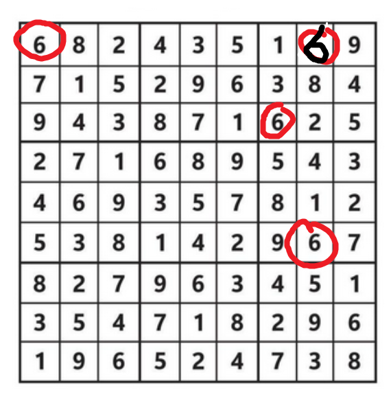

# Loss functions

## Basic loss function
Have a specific answer set, and score **every** number output against the input, including those in the initial input.

Benefits:
- easy to implement
- might help with understanding of the entire puzzle

Drawbacks:
- Might mainly be training the model to just memorise the input rather than anything else
- Comparing against a known correct answer, if the model makes some mistakes then it might be correctly placing other numbers based on those mistakes, but that isn't reflected in the loss score

## Unknown only loss function
Replace the predictions in the known areas with the same input values, effectively disregarding the model's output for the known values. Score based on the entire puzzle, including the replaced values

**Note:** could we have a version of this which only scores the unknown values?

Benefits:
- score the model based on the unknown values, so encourage it to learn the rules of the game instead
- very fast to get to high % accuracy

Drawbacks:
- Loss may vary from puzzle to puzzle based on number of known inputs (will get better loss if more inputs already known)
    - could this affect the gradient calculations?
- Might limit the understanding of the model for the whole puzzle, since it might be giving terrible predictions for the known values but these aren't included in the loss calculations
- Comparing against a known input, if the model makes some mistakes then it might be correctly placing other numbers based on those mistakes, but that isn't reflected in the loss score

# Validate each cell loss function
Check each number in the output, and punish any number which breaks the rules.

Benefits:
- Allows for mistakes and only punishing numbers that break the rules, rather than having a fixed answer which the model may get only partially correct

Drawbacks:
- Difficult to implement
- Will be slow to run
- How to score incorrect answers?